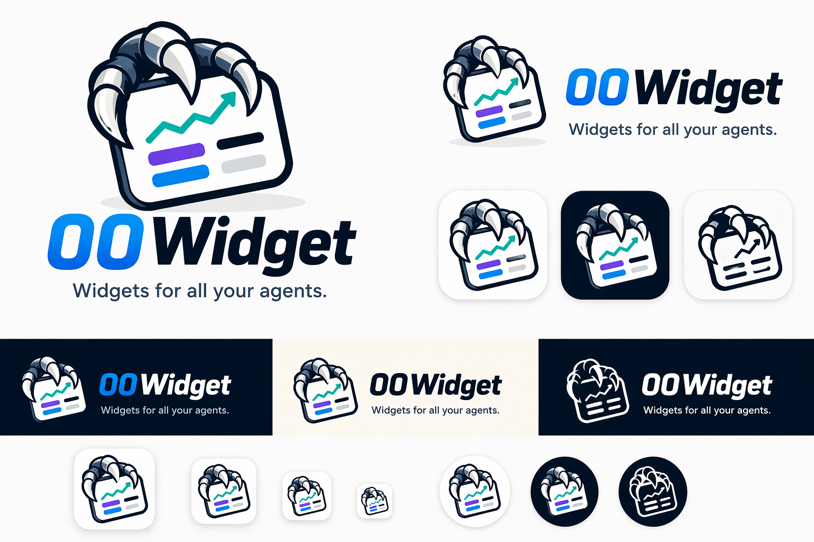

# 00Widget — Brand

The official brand assets and usage rules.

## Tagline

> Widgets for all your agents.

Use this exact wording — no rephrasing. It appears in:

- top-level `README.md`
- `ios/Resources/App/Info.plist` (CFBundleDisplayName tagline area)
- store listings, social cards

## Logo

The mark is a stylised claw clutching a widget card with a rising trend line, paired with the wordmark **00Widget** (the `00` is in the brand blue, `Widget` in dark navy).

### Variants in the sheet

- **Hero**: full mark + wordmark + tagline (top-left). Use for landing pages.
- **Horizontal lockup**: icon + wordmark side-by-side. Use for navigation bars, GitHub social cards.
- **App icon**: rounded-square frame, three contrasts (light, dark navy, mono). Use for iOS, macOS, web favicons.
- **Banner strips**: dark / cream / dark variants for headers.
- **Reduced sizes**: bottom row, for confirming the mark survives at small dimensions.

## Color palette

Sampled from the brand sheet (treat as approximate until vector source lands):

| Role            | Approx hex   | Usage                                  |
| --------------- | ------------ | -------------------------------------- |
| Brand blue      | `#1F8BFF`    | "00" wordmark, primary accents, links  |
| Dark navy       | `#0E1A2E`    | "Widget" wordmark, body text on light  |
| Cream           | `#F5EFE3`    | Light banner background                |
| Trend teal      | `#1FB89A`    | Trend-line accent inside the mark      |
| Purple accent   | `#5C4BD9`    | Card-row accent inside the mark        |
| Card blue       | `#2D7CF7`    | Card-row accent inside the mark        |

## What's here vs what we need

The committed `branding-sheet.png` is **a 1536×1024 contact sheet**. It's high enough resolution for documentation, READMEs, and GitHub social cards, but too low to upscale into a crisp 1024×1024 iOS app icon.

**Still needed:**

- `mark-1024.png` — icon-only (claw + widget card, no text), 1024×1024, with transparent background. Source for the iOS app icon.
- `wordmark-horizontal.png` — icon + "00Widget" wordmark side-by-side, transparent background, ≥2400px wide. Source for navigation lockups.
- `mark.svg` and `wordmark.svg` — vector source. Future-proofing for arbitrary scales.

When those land in this directory, replace the placeholder app icon at `ios/Resources/App/Assets.xcassets/AppIcon.appiconset/` and remove the `TODO(brand)` markers.

## Usage rules

- **Do not** rephrase the tagline.
- **Do not** recolor the mark (no purple-only versions, no rainbow). Use the supplied light/dark/mono variants as-is.
- **Do** keep clearspace around the mark equal to half the height of the "0" in `00Widget`.
- **Do not** stretch — preserve aspect ratio always.
